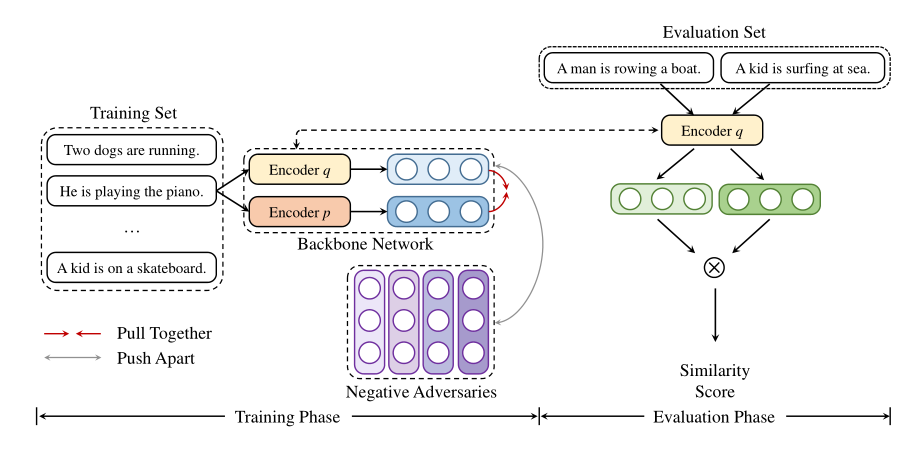

## AdCSE: An Adversarial Method for Contrastive Learning of Sentence Embeddings

This repository contains the source code for our paper [AdCSE: An Adversarial Method for Contrastive Learning of Sentence Embeddings](https://anonymous.4open.science/r/AdCSE-2B77).


## Quick Links

  - [Overview](#overview)
  - [Train AdCSE](#train-AdCSE)
    - [Requirements](#requirements)
    - [Evaluation](#evaluation)
    - [Training](#training)


## Overview

In this article, we demonstrate that high-quality negative representations introduced by adversarial training help to learn powerful sentence embeddings. We design a novel method for unsupervised sentence embedding named AdCSE. It consists of an untied dual-encoder backbone network for embedding positive sentence pairs and a group of negative adversaries for training hard negatives. These two parts of AdCSE compete against each other mutually in an adversarial way for contrastive learning, obtaining the most expressive sentence representations while achieving an equilibrium. 

Experiments on 7 STS tasks show the effectiveness of AdCSE. The superiority of this model in constructing high-quality sentence embeddings is also validated by ablation studies and quality analysis of representations.




## Train AdCSE

In the following section, we describe how to train a AdCSE model by using our code.

### Requirements

First, install PyTorch by following the instructions from [the official website](https://pytorch.org). To faithfully reproduce our results, please use the correct `1.7.1` version corresponding to your platforms/CUDA versions. PyTorch version higher than `1.7.1` should also work. For example, if you use Linux and **CUDA11** ([how to check CUDA version](https://varhowto.com/check-cuda-version/)), install PyTorch by the following command,

```bash
pip install torch==1.7.1+cu110 -f https://download.pytorch.org/whl/torch_stable.html
```

If you instead use **CUDA** `<11` or **CPU**, install PyTorch by the following command,

```bash
pip install torch==1.7.1
```


Then run the following script to install the remaining dependencies,

```bash
pip install -r requirements.txt
```

### Evaluation
Our evaluation settings are just the same as [SimCSE (Gao et al., 2021)](https://arxiv.org/abs/2104.08821), so we directly use the evaluation code from their [repo](https://github.com/princeton-nlp/SimCSE). AdCSE evaluates sentence embeddings on semantic textual similarity (STS) tasks and downstream transfer tasks. For STS tasks, our evaluation takes the "all" setting, and report Spearman's correlation. 

Before evaluation, please download the evaluation datasets by running
```bash
cd SentEval/data/downstream/
bash download_dataset.sh
```

Then come back to the root directory, you can evaluate AdCSE using our evaluation code. For example,
```bash
python evaluation.py \
    --model_name_or_path result/AdCSE \
    --pooler cls_before_pooler \
    --task_set sts \
    --mode test
```
* `--model_name_or_path`: Path of the evaluated model. 
* `--pooler`: Pooling method during evaluation. To reproduce results in our paper, it should be set to `cls_before_pooler` which is different from the training phase.


### Training

**Data**

For AdCSE, we use 1 million randomly sampled sentences from English Wikipedia which are provided by [SimCSE](https://arxiv.org/abs/2104.08821). You can run the script `data/download_wiki.sh` to download this dataset.

**Training scripts**

We provide an example training script `run_adcse.sh` for AdCSE. Note that we only support single-GPU for AdCSE right now. 
We explain the arguments in following:
* `--train_file`: Training file path. We support "txt" files (one line for one sentence) and "csv" files (2-column: pair data with no hard negative; 3-column: pair data with one corresponding hard negative instance). You can use the provided Wikipedia data, or you can use your own data with the same format.
* `--model_name_or_path`: Pre-trained checkpoints to start with.
* `--learning_rate`: Learning rate of encoder $q$.
* `--pooler_type`: Pooling method. It's the same as the `--pooler_type` in the [evaluation part](#evaluation).
* `--mlp_only_train`: We have found that for unsupervised AdCSE, it works better to train the model with MLP layer but test the model without it. You should use this argument when training unsupervised AdCSE models.
* `--moco_m`: Momentum for updating encoder $p$.
* `--moco_t`: Temperature for the contrastive loss $L$.
* `--mem_m`: Momentum for updating negatives adversaries.
* `--mem_t`: Temperature for updating negatives adversaries.
* `--mem_lr`: Learning rate for negatives adversaries.
* `--mem_wd`: Weight decay for updating negatives adversaries.
* `--neg_num`: Number of negatives adversaries.

All the other arguments are standard Huggingface's `transformers` training arguments. Some of the often-used arguments are: `--output_dir`, `--learning_rate`, `--per_device_train_batch_size`. In our example scripts, we also set to evaluate the model on the STS-B development set (need to download the dataset following the [evaluation](#evaluation) section) and save the best checkpoint.

For results in the paper, we use Nvidia 3090 GPUs with CUDA 11. Using different types of devices or different versions of CUDA/other softwares may lead to slightly different performance.

**Hyperparameters**

We use the following hyperparamters for training AdCSE:

|               | AdCSE |
|:--------------|:-----------:|
| Batch size    | 64          |
| Learning rate of encoder $q$| 3e-5 |
| Learning rate of negative adversaries| 3e-3 |
| Max_seq_length| 32 |
| Tempareture for $L$ | 0.05 |
| Momentum for encoder $p$ | 0.995 |
| Weight decay for negative adversaries| 1e-4 |
| Number of hard negatives | 64 |
